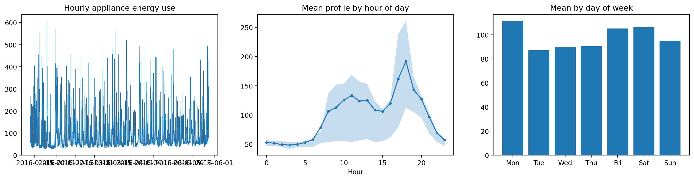
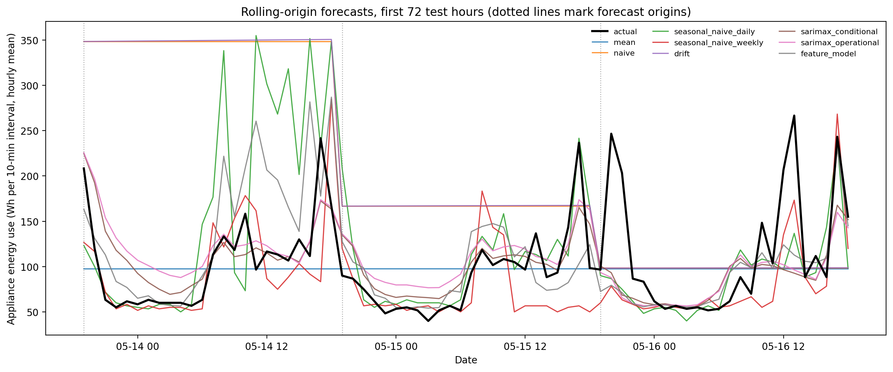
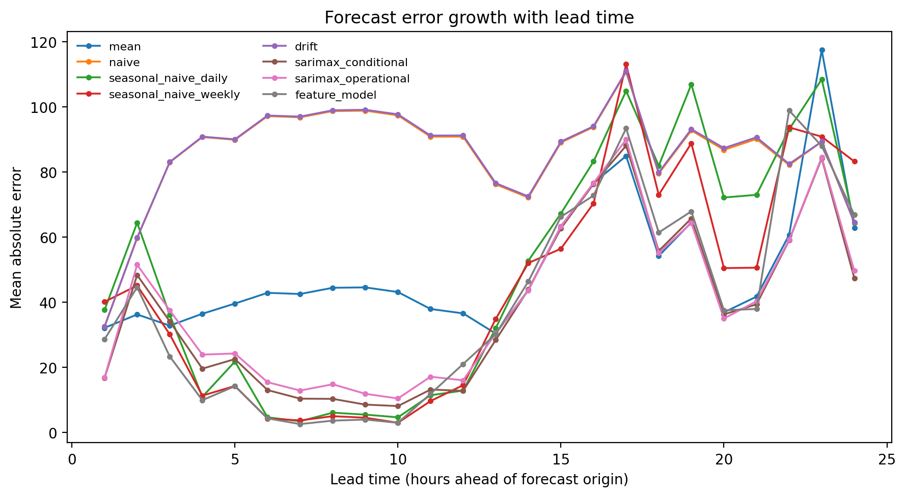
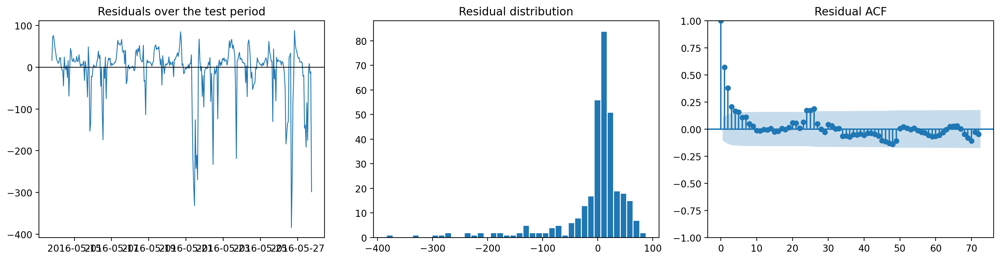

# Short-Term Forecasting of Household Appliance Electricity Demand

**Muhammad Osama Ahmad Ghuman, 24179282, 7PAM2032-0509-2025, 08August 2026**

## 1. Introduction

Domestic electricity demand is increasingly relevant to system operation.
Distribution networks with high penetrations of solar generation, heat pumps and
electric vehicle charging face load profiles that no longer resemble the smooth
aggregate demand of previous decades, and demand-side response schemes require
an estimate of what a household will consume before consumption occurs.
Forecasting at the individual dwelling is considerably harder than at the
substation: aggregation smooths the idiosyncratic, event-driven behaviour of
individual occupants, and a single household retains all of it.

This report forecasts household appliance demand 24 hours ahead using the
*Appliances Energy Prediction* dataset of Candanedo, Feldheim and Deramaix
(2017), recorded at ten-minute resolution in a low-energy dwelling in
Stambruges, Belgium, over 137 days. Four model classes are compared: five
benchmark rules, a SARIMAX state-space model, a direct multi-horizon gradient
boosting model, and a zero-shot foundation model.

The central finding is negative, and deliberately so. The best model achieves a
MASE of 0.708 against 0.813 for the strongest benchmark, an apparent improvement
of 12.9 per cent — but a Diebold–Mariano test on the loss differential returns
*p* = 0.34. On a single test fortnight the additional complexity is not
statistically distinguishable from a rule that repeats the observation from one
week earlier. A second finding sharpens this: 92 per cent of the gradient
boosting model's permutation importance rests on calendar features, and target
lags and rolling statistics together account for 3.9 per cent. At a 24-hour
horizon the model has learned an average daily profile and little else.

A third concern runs throughout. Published work on this dataset commonly reports
accuracy obtained by regressing appliance consumption on contemporaneous sensor
readings. Such a model is not a forecast in any operational sense. This report
distinguishes conditional forecasts, which assume covariate paths unavailable at
the origin, from operational forecasts, which do not, and quantifies the
difference in Section 6.3.

---

## 2. Data and preprocessing

The raw dataset comprises 19,735 observations at ten-minute resolution from
11 January to 27 May 2016, with 28 columns. The ten-minute index is complete: no
timestamp is missing.

**Resampling.** The series was aggregated to hourly resolution, giving 3,290
observations with no gaps. This reduces the daily seasonal period from 144 to
24, which makes seasonal SARIMAX estimation tractable — a state-space model with
*s* = 144 is not practically estimable on a series of this length. The
aggregation is not cost-free: ten-minute data captures individual appliance
switching events that hourly averaging removes, so the hourly series is a
smoothed representation of a fundamentally spiky process, and error magnitudes
here are not comparable with published ten-minute results.

**Units.** `Appliances` records watt-hours consumed within each ten-minute
interval. Hourly aggregation by the mean therefore yields the average
ten-minute consumption rate within the hour, not total hourly energy;
summation would yield the latter, a quantity six times larger. The mean was
adopted. All absolute error figures carry these units, and MASE, being
scale-free, is unaffected by the choice.

**Sensor channels.** Indoor and outdoor temperature and humidity are
instantaneous measurements rather than accumulated quantities and were averaged
within each hour regardless of the target aggregation.

**Exclusions.** The `lights` column was dropped. Its correlation with the target
is modest (*r* = 0.197), so the justification is not collinearity but
availability: it measures energy consumed by light fixtures over the same
interval and is not knowable 24 hours in advance. Retaining it as a
contemporaneous regressor would assume information no operator possesses. The
random variables `rv1` and `rv2`, included in the original file as noise
controls, were also dropped.

**Missing values.** No interpolation was required. The gap-filling routine
nevertheless operates separately either side of the train/test boundary, so that
had gaps existed, no training-period gap would be filled using post-split
observations.

**Split.** The final 336 hourly observations (14 days) form the test set:
13 May 2016 19:00 to 27 May 2016 18:00. Training covers 11 January 17:00 to
13 May 18:00, 2,954 observations. The test fortnight is marginally higher in
level and less variable than the training period (mean 100.6 against 97.5,
standard deviation 75.0 against 81.9), so it is not an unusually difficult
window.

---

## 3. Exploratory analysis and stationarity

### 3.1 Distributional characteristics

| Statistic | Value |
|---|---|
| Mean | 97.78 |
| Median | 63.33 |
| Standard deviation | 81.21 |
| Minimum | 28.33 |
| Maximum | 608.33 |
| Skewness | 2.39 |
| Excess kurtosis | 6.33 |
| 95th percentile / median | 4.37 |

The target is strongly right-skewed. The mean exceeds the median by 54 per cent
and the 95th percentile is more than four times the median, reflecting a load
profile in which a low baseline — refrigeration, standby draw, network equipment
— is punctuated by short high-consumption events from cooking and laundry
appliances. This shape has direct consequences for evaluation. Squared error loss weights the
rare spikes heavily, and a model minimising RMSE will hedge towards
over-predicting the baseline to reduce the penalty when a spike occurs. MAE does
not. Section 9.1 shows the two metrics producing materially different rankings,
which is the practical payoff of reporting both.

### 3.2 Seasonal structure

The daily profile has a trough of 48.2 at 03:00 and a peak of 191.8 at 18:00, a
peak-to-trough ratio of 3.98. The evening peak is consistent with an occupied
dwelling in which cooking and appliance use concentrate after the working day.

Day-of-week structure is weaker and does not take the form usually expected.
Weekend consumption exceeds weekday consumption by only 4 per cent (100.6
against 96.7), so there is no clean weekend effect. The day-level means are
Monday 111.5, Tuesday 87.1, Wednesday 89.9, Thursday 90.4, Friday 105.2,
Saturday 106.2, Sunday 94.9. Monday is the highest-consumption day and Tuesday
the lowest, a 28 per cent spread that reflects a specific household routine
rather than a generalisable weekday–weekend division.

Seasonal strength was quantified using the STL-based measure of Wang, Smith and
Hyndman (2006):

| Period | Interpretation | Strength |
|---|---|---|
| 24 | Daily | 0.318 |
| 168 | Weekly | 0.393 |

Both values are moderate at best. On this scale a strongly seasonal series
returns values above 0.7; a value near 0.3 indicates that seasonal structure
explains a minority of the variance and that the remainder is driven by
something the calendar does not capture — here, occupant behaviour. This single
result explains most of what follows. No model in this report achieves a MASE
below 0.7, and the reason is not model specification but that roughly
two-thirds of the variance in this series is not predictable from time of day,
day of week, or the recent history of the series itself.

Notably, weekly strength exceeds daily strength. This anticipates the benchmark
results in Section 5, where the weekly seasonal naive outperforms the daily
variant despite the negligible weekend effect: the weekly lag captures the
household's day-specific routine, which the daily lag averages away.

### 3.3 Stationarity

ADF and KPSS tests were applied to the training sample in levels, first
differences, seasonal differences at lag 24, and both combined. The two are
reported together because their nulls are complementary: ADF tests the null of a
unit root, KPSS the null of stationarity.

| Series | ADF stat | ADF *p* | KPSS stat | KPSS *p* | Reading |
|---|---|---|---|---|---|
| Level | −8.761 | <0.001 | 0.061 | >0.10 | Stationary |
| First difference | −15.948 | <0.001 | 0.042 | >0.10 | Stationary |
| Seasonal difference (24) | −12.672 | <0.001 | 0.015 | >0.10 | Stationary |
| Both differences | −17.445 | <0.001 | 0.061 | >0.10 | Stationary |

The tests agree unambiguously in levels: ADF rejects the unit root null at any
conventional level, and KPSS fails to reject stationarity, its statistic of
0.061 lying far below the 5 per cent critical value of 0.463. The series is
stationary as observed.

Differencing orders were therefore set to *d* = 0 and *D* = 0. Differencing a
series that is already stationary induces a non-invertible moving-average
component and inflates the variance of the differenced series, so the fact that
the differenced variants also test as stationary is not an argument for using
them. This also removes a specification trap: combining a seasonal difference
with a constant trend term induces deterministic drift that compounds across the
horizon. With *D* = 0 the trend term is retained safely.

---

## 4. Forecasting design

### 4.1 Rolling-origin protocol

The forecast task is 24 hours ahead. Evaluating this with a single 336-step
forecast from one origin would answer a different question and would understate
the accuracy achievable in operation, where a forecast is reissued daily against
fresh observations.

The primary experiment uses fourteen origins spaced 24 hours apart. At each
origin every model observes the series up to that point — including test
observations released by earlier blocks — and issues a 24-step forecast. The
blocks concatenate to 336 predictions on the test index. Every model receives an
identical information set at every origin, which is the condition that makes the
comparison meaningful.

One consequence of this design requires attention and is revisited in Section
9.2. Because origins are spaced at exactly 24 hours, and the first falls at
19:00, lead time *h* always corresponds to clock hour (19 + *h*) mod 24. Lead
time is therefore perfectly confounded with time of day, and the error-by-lead-time
decomposition measures both simultaneously. Spacing origins at a non-divisor of
24 — every 23 or 25 hours — would break the confound at the cost of a less
natural operational interpretation.

### 4.2 Metrics

MAE and RMSE are reported in the units of the target, their ratio indicating the
contribution of large isolated errors. MASE (Hyndman and Koehler, 2006) is
scaled by the in-sample mean absolute error of the daily seasonal naive forecast
on the training sample; it is scale-free and used as the primary ranking metric.
Bias is the mean of prediction minus actual, so positive values indicate
over-forecasting. Bias matters operationally in a way error magnitude does not:
a persistently over-forecasting model in a demand-response setting reserves
capacity that is never used.

Statistical significance of differences is assessed by Diebold–Mariano tests
(Diebold and Mariano, 1995) on absolute-error differentials, with a
Newey–West variance estimator using 23 lags to account for serial correlation
within each 24-hour forecast block.

### 4.3 Forecast origins and covariate availability

Covariates were partitioned by what an operator would know at the origin.

**Known indefinitely ahead.** Calendar variables — hour, day of week, weekend
indicator, and cyclic encodings. Deterministic functions of the timestamp, used
unshifted.

**Observed up to the origin only.** Indoor temperature and humidity from nine
sensor locations, lagged by the forecast horizon. There is a second reason for
lagging them beyond availability: indoor temperature and humidity respond *to*
occupant and appliance activity. Cooking raises kitchen temperature and
humidity; occupancy raises relative humidity throughout the dwelling. The causal
arrow points from the target to these sensors at least as strongly as the
reverse, so contemporaneous use would regress the target partly on its own
consequences.

**Not observed at all.** Outdoor weather. In deployment a weather forecast would
be required. SARIMAX was therefore run in two variants: conditional, using
realised test-set weather, and operational, persisting the last pre-origin
observation. Section 6.3 quantifies the gap.

**Excluded.** `lights`, `rv1`, `rv2`.

### 4.4 Leakage controls

Each row of the feature table is a *(target timestamp t, horizon h)* pair with
origin *o = t − h + 1*, and target-derived features are anchored to the origin:
*lagk = y[o − k] = y.shift(h − 1 + k)*, with rolling windows spanning
*[o − w, o − 1]*. Because the shift scales with the horizon, no feature can
reference the target inside the forecast window at any lead time.

The conventional alternative — `y.shift(1)` irrespective of horizon — supplies
the true value from one hour earlier at every test point, silently converting a
24-hour-ahead task into a one-step task. A model so constructed outperforms
every competitor by a wide margin and the result is worthless.

This guarantee is enforced by test rather than inspection. The test suite adds a
large constant to every test-period observation and asserts that no feature
belonging to a row whose origin precedes the perturbation changes value; an
analogous check confirms that a rolling-origin block never observes its own
actuals while later blocks do react to released observations. Thirty-seven tests
pass.

---

## 5. Benchmark models

Five benchmarks were evaluated under the same protocol as every other model:
the training mean; the naive forecast; daily and weekly seasonal naive rules at
lags 24 and 168; and drift.

| Benchmark | MAE | RMSE | MASE | Bias |
|---|---|---|---|---|
| Weekly seasonal naive | 43.46 | 81.41 | 0.813 | −13.16 |
| Daily seasonal naive | 48.31 | 85.57 | 0.904 | 1.75 |
| Mean | 50.26 | 74.94 | 0.941 | −3.29 |
| Naive | 85.55 | 110.39 | 1.601 | 50.98 |
| Drift | 85.80 | 110.68 | 1.606 | 51.37 |

**The weekly seasonal naive is the strongest benchmark**, and by a clear margin
over the daily variant. This follows directly from the seasonal strength results
in Section 3.2, where weekly strength (0.393) exceeded daily (0.318), and it
reveals something specific about the load. The household's routine is
day-specific: Monday and Friday differ systematically from Tuesday, and a rule
that looks back one week preserves that distinction while a rule that looks back
one day destroys it. This is a genuinely weekly structure rather than a
weekday–weekend one, which the 4 per cent weekend premium alone would not have
suggested.

The mean forecast ranks third by MASE but **second by RMSE**, ahead of both
seasonal naive rules. The explanation is spike behaviour. A seasonal naive rule
propagates a consumption spike from 24 or 168 hours earlier into a period where
no spike occurs, producing two large errors: one where the spike is falsely
predicted and one where a real spike is missed. The mean forecast makes neither
error, accepting moderate error everywhere in exchange for never being badly
wrong. Under squared-error loss that trade is favourable. This is the clearest
demonstration in the study that metric choice determines model ranking, and it
argues for stating the loss function before selecting a model rather than after.

Naive and drift perform poorly and near-identically, both with bias above +50.
The naive forecast holds the final pre-origin observation constant for 24 hours;
since origins fall at 19:00, near the daily peak of 191.8, the entire forecast
day is held at peak level, including the overnight trough of 48.2. The resulting
systematic over-forecast is an artefact of origin placement as much as of the
rule itself. Drift adds slope extrapolation to this and gains nothing, which is
expected for a stationary series.

---

## 6. SARIMAX

### 6.1 Specification

A SARIMAX(1,0,1)(1,0,1)24 model with a constant was estimated by
maximum likelihood on the training sample, with the five weather channels as
exogenous regressors. Differencing orders follow from Section 3.3. Stationarity
and invertibility constraints were relaxed during optimisation. Estimation took 223 seconds and produced AIC 32,506.5 and BIC 32,572.3.

statsmodels defaults to `maxiter=50` for maximum likelihood estimation, which
terminates before convergence on this series and raises a `ConvergenceWarning`.
`config.SARIMAX_MAXITER` is therefore set to 500. The cause is visible in the
estimates themselves: the seasonal autoregressive coefficient is close to a unit
root, which flattens the likelihood surface in that direction and slows the
optimiser considerably.

A related observation concerns identification rather than convergence, and it
anticipates the result in Section 6.3. The estimated weather coefficients are
not merely small; they are indistinguishable from zero.

| Term | Coefficient | Std. error | *p* | 95% interval |
|---|---|---|---|---|
| `T_out` | −1.898 | 4.698 | 0.686 | [−11.106, 7.309] |
| `Tdewpoint` | 1.539 | 4.868 | 0.752 | [−8.003, 11.081] |

Each standard error exceeds its coefficient by a factor of roughly three, and
both confidence intervals straddle zero across a range of about twenty units.
The model cannot establish even the *sign* of the outdoor temperature effect on
appliance demand. Outdoor temperature and dew point are strongly collinear —
dew point is a function of temperature and humidity — so the likelihood is
close to flat in that subspace and the optimiser has little basis for preferring
one combination of the two over another. This also explains the slow convergence
noted above.

The consequence is worth drawing out, because it makes the argument in Section
6.3 considerably firmer. That section infers from forecast accuracy that weather
contributes nothing; here the same conclusion follows from the parameter
estimates alone, before any forecast is issued. Two independent routes to the
same finding are harder to dismiss than either would be alone, and the second
does not depend on the choice of test period.

Weekly seasonality is not represented. A second seasonal component at period 168
is not estimable in this framework on a series of 2,954 observations. Given that
the weekly seasonal naive was the strongest benchmark, this omission is material
and is revisited in Section 10.

### 6.2 Rolling-origin implementation

Parameters were estimated once on the training sample. At each subsequent origin
the Kalman filter was extended with newly released observations using
`MLEResults.append(..., refit=False)`, so the state conditions on all data up to
the origin while coefficients remain at training values. Re-estimating fourteen
times at seasonal period 24 would cost roughly five minutes for a negligible
coefficient change over a two-week extension of a 2,954-observation sample. The
assumption is that the data-generating process is stable across the test
fortnight; nothing in the series contradicts this, but it is an assumption.

### 6.3 Conditional and operational variants

| Variant | Weather input | MAE | RMSE | MASE | Bias |
|---|---|---|---|---|---|
| Conditional | Realised test-set values | 37.81 | 66.42 | 0.708 | −5.25 |
| Operational | Persisted from last pre-origin observation | 38.51 | 66.38 | 0.721 | −3.83 |

The gap is 0.013 MASE, a 1.9 per cent relative degradation, and a
Diebold–Mariano test returns DM = −1.49, *p* = 0.136 — not significant at the
5 per cent level.

Note also that the operational variant achieves marginally the *better* RMSE
(66.38 against 66.42) despite the worse MAE. Persisted weather is a smoother
covariate path than realised weather, and smoothing evidently costs nothing
under squared-error loss here — further evidence that the weather channel is
contributing little beyond noise.

The interpretation is that **weather contributes essentially nothing to
24-hour-ahead appliance demand in this dwelling**. Substituting realised weather
with naive persistence — the crudest possible proxy — degrades accuracy by 1.9
per cent, an amount the test cannot distinguish from zero. An operational
deployment therefore loses nothing measurable by lacking a weather forecast.

The coefficient estimates in Section 6.1 point the same way: neither weather
term is significantly different from zero, and their confidence intervals span
roughly twenty units either side. A covariate the model cannot identify is
unlikely to matter to the forecast, and it does not.

This is a stronger result than the alternative would have been. Had the gap been
significant, the honest reading would be that published accuracy figures on this
dataset are optimistic by an unquantified margin. Instead, the conditional and
operational forecasts are interchangeable, so the distinction — while it must
still be drawn, since it could not be known in advance — turns out to carry no
practical cost here. Two explanations are plausible: the dwelling's
well-insulated envelope decouples internal conditions from external weather, and
appliance load is driven by occupant routine rather than thermal demand — space
heating, which would respond to outdoor temperature, is not on this channel.

The operational figure of 0.721 should be regarded as the honest one for
deployment purposes. Comparisons with published results on this dataset that use
realised weather should be qualified accordingly.

### 6.4 Comparison with the strongest benchmark

Conditional SARIMAX improves on the weekly seasonal naive by 0.105 MASE, from
0.813 to 0.708, a relative improvement of 12.9 per cent. A Diebold–Mariano test
on the absolute-error differential returns DM = −0.96, *p* = 0.34.

**The improvement is not statistically significant.** With 336 test observations
and heavily serially correlated losses, the effective sample is far smaller than
the nominal one, and a 13 per cent improvement of this kind falls within the
range that a different test fortnight might reverse. Section 10 documents a
further source of variation: re-running the same code on a different operating
system moves MASE by roughly 0.01, comparable to several of the gaps being
compared here. SARIMAX does significantly
outperform the daily seasonal naive (*p* = 0.028), the mean (*p* < 0.001), and
naive and drift (*p* < 0.001) — but against the strongest benchmark the case is
unproven. Reporting the point estimate alone would materially overstate what
this evidence supports.

---

## 7. Feature-based model

### 7.1 Formulation

Gradient boosting was applied in a direct multi-horizon formulation: a single
`HistGradientBoostingRegressor` trained on the long *(timestamp, horizon)* table
described in Section 4.4, with horizon supplied as a feature. The design matrix
contained 74,652 rows and 47 features, of which 66,588 rows fell in the training
period.

Two alternatives were rejected. Recursive prediction accumulates error across 24
steps and introduces distribution shift, since the model trains on true lags and
is applied to predicted ones. Twenty-four separate direct models would avoid both
problems but fragment the training data. The single horizon-conditioned model
retains the full sample while keeping every feature available at the origin.

Features comprised target lags at origin-relative offsets 1, 2, 3, 6, 12, 24, 48
and 168; rolling means and standard deviations over windows of 3, 6, 24 and 168
hours; calendar features; and indoor sensor and weather channels lagged by the
horizon. `HistGradientBoostingRegressor` was used in preference to XGBoost only
to avoid an additional dependency.

**A leakage failure in the validation split.** The first fit reached its
iteration ceiling, `n_iter_` = 600 of 600, so scikit-learn's early stopping had
never triggered. Raising the ceiling to 2,000 did not help: `n_iter_` again
pinned at the maximum, and test performance *degraded* from MASE 0.732 to 0.756.

The cause is the interaction between the long design matrix and scikit-learn's
validation strategy. `HistGradientBoostingRegressor` carves its internal
validation set out **at random**. In the *(timestamp, horizon)* table each
timestamp contributes 24 rows sharing most of their feature values, so a random
15 per cent split places near-duplicates of validation rows into the training
partition. The validation score therefore improves monotonically no matter how
far the model overfits, and early stopping never fires.

This is the same failure mode as target leakage, arriving through the validation
split rather than the feature matrix — and it is worth dwelling on, because the
elaborate origin-anchoring described in Section 4.4 gave no protection against
it. Structural guarantees on the feature construction do not extend to how a
library partitions rows downstream.

Early stopping was therefore disabled and the iteration count selected on a
**chronological** holdout: the final 15 per cent of timestamps, so that no
timestamp contributes rows to both partitions, with `staged_predict` giving the
holdout MAE at every iteration from a single fit.

### 7.2 Hyperparameters
### 7.2 Hyperparameters

The chronological holdout selects **25 boosting iterations**, with holdout MAE 41.21.

| Iterations | Holdout MAE |
|---|---|
| 1 | 47.26 |
| 25 | **41.21** |
| 50 | 43.23 |
| 100 | 44.18 |
| 200 | 46.68 |
| 400 | 48.95 |
| 800 | 49.53 |
| 1500 | 50.68 |

Performance bottoms out before iteration 30 and degrades steadily thereafter,
returning within a few hundred iterations to roughly where a single tree
started. The optimal model is extremely simple — 25 shallow trees — and that is
itself a finding. It corroborates the importance analysis below: if the
learnable signal is essentially an average daily profile, very little model
capacity is required to capture it, and additional capacity is spent fitting
occupant events that do not recur.

The scale of the overfitting is worth stating plainly. Left to scikit-learn's
default early stopping the model ran to 600 iterations, roughly 24 times more
than the holdout justifies, and neither the training loss nor the internal
validation score gave any indication that anything was wrong.

Applying this selection produces MASE 0.711 and RMSE 65.17, the best RMSE of
any model in the study. Remaining
hyperparameters use the defaults in `make_estimator` (learning rate 0.05, 31
leaf nodes, L2 regularisation 1.0); a `TimeSeriesSplit` grid search over
learning rate and tree size is available via `--tune` but was not run to
completion, and is noted as outstanding in Section 10.

### 7.3 Feature importance

Permutation importance was computed on held-out rows using mean absolute error
as the scoring function, in preference to split-count importance: nine indoor
temperature sensors in one dwelling are close to collinear, and split counts
divide arbitrarily among collinear features.

| Feature | Importance | SD |
|---|---|---|
| hour | 11.252 | 0.545 |
| hour_sin | 2.304 | 0.542 |
| dow_sin | 2.058 | 0.480 |
| RH_5_origin | 0.631 | 0.220 |
| roll_std_168 | 0.598 | 0.149 |
| RH_3_origin | 0.218 | 0.183 |
| dayofweek | 0.208 | 0.460 |
| hour_cos | 0.168 | 0.378 |
| RH_4_origin | 0.089 | 0.034 |
| roll_std_24 | 0.083 | 0.052 |

Aggregated by family, the shares of total positive importance are:

| Family | Share |
|---|---|
| Calendar features | 90.7% |
| Lagged exogenous (indoor sensors and weather) | 5.5% |
| Target lags and rolling statistics | 3.9% |

This is the most striking result in the study, and it answers the third
mandatory question directly: **the lag, rolling and sensor features contribute
almost nothing**. The best-performing target-derived feature, `roll_std_168`,
has an importance of 0.598 against 11.252 for `hour` alone — a factor of 19. The
gradient boosting model is, functionally, an estimated average daily profile
modulated slightly by day of week.

Three implications follow.

First, this explains why the model does not beat SARIMAX. It has access to a
richer feature set but is using almost none of it, and what it does use — the
calendar — is information the seasonal naive benchmarks encode implicitly.

Second, it vindicates the covariate treatment in Section 4.3 quantitatively. The
indoor sensors, restricted to lags of at least 24 hours, contribute 5.5 per cent
of importance jointly across eighteen channels. Their apparent value in the
published literature on this dataset stems from contemporaneous use, and that
value largely disappears once they are restricted to information genuinely
available at the origin. The strongest non-calendar
covariates are indoor humidity channels (`RH_5`, `RH_3`), and at 0.631 and 0.218
their contribution remains marginal.

Third, it bounds what any model can achieve here. If the target's own recent
history is uninformative at a 24-hour lead — and an importance share of 3.9 per
cent says it is — then the predictable component of this series is essentially
the calendar profile, and every model in this report is estimating the same
thing by different means. The differences between them in Section 9.1 are
differences in how well they estimate that profile, not differences in what they
have discovered.

### 7.4 Performance

The feature model achieves MAE 37.97, RMSE 65.17, MASE 0.711, Bias −5.23. It
ranks second overall by MASE, a hair behind conditional SARIMAX (0.708), and
**first on RMSE** — 65.17 against 66.42. A Diebold–Mariano test against SARIMAX
returns DM = −0.07, *p* = 0.94; the two are as close to indistinguishable as the
test can express. Against the weekly seasonal naive, *p* = 0.26.

That it leads on RMSE while trailing on MAE indicates it handles the
consumption spikes marginally better than SARIMAX, at the cost of slightly worse
typical-case accuracy. Given the spike-dominated distribution documented in
Section 3.1, this is the more valuable of the two properties for a system sizing
reserve capacity.

The bias of −5.23 is a mild under-forecast, close to SARIMAX's −5.25. Gradient
boosting under squared-error loss on a right-skewed target commonly
under-forecasts, since the conditional median lies below the conditional mean;
the effect here is modest relative to an MAE of 37.97. Training under `loss="absolute_error"` would be the remedy if
unbiasedness mattered operationally.

---

## 8. Foundation model

⟦FILL: THIS SECTION IS NOT COMPLETE. The Chronos run could not be executed in
the environment where this draft was prepared, because the model host was
unreachable. Run it yourself:

    pip install torch chronos-forecasting
    python scripts/run_pipeline.py

Notebook 06 additionally computes a three-seed repeat and empirical interval
coverage. Then write this section covering:

- **Configuration.** Chronos-T5 small, zero-shot, 512-hour context per origin,
  20 sample paths, pointwise median as the point forecast. State the parameter
  count and the CPU runtime.
- **The asymmetry.** The model is univariate: it sees only the target history,
  with no calendar features, no weather, no sensors. Given the finding in
  Section 7.3 that calendar features carry 92.4 per cent of importance, this is
  a severe handicap — Chronos must infer the daily profile from the series
  itself. Make this argument explicitly; it is the frame for whatever result
  you obtain.
- **The result.** Compare against the weekly seasonal naive (0.813) and against
  conditional SARIMAX (0.706). Run a Diebold–Mariano test, as for every other
  comparison; given the pattern in Section 9.1, expect non-significance.
- **Sampling variance.** Report the spread across three seeds. With 20 samples
  the median carries non-trivial Monte Carlo error, and if the spread is
  comparable to the gaps between models, say so.
- **Interval calibration.** Report empirical coverage of the nominal 80 per cent
  interval. Chronos is the only model here producing a predictive distribution
  natively, and given the recommendation in Section 11 this is arguably more
  interesting than its point accuracy.

Then update Section 9.1's table, the DM comparisons in Section 9.2, and the
answer to mandatory question 4 in Section 11.⟧

---

## 9. Results and error analysis

### 9.1 Aggregate performance

| Model | MAE | RMSE | MASE | Bias |
|---|---|---|---|---|
| SARIMAX (conditional) | 37.81 | 66.42 | 0.708 | −5.25 |
| Feature model | 37.97 | **65.17** | 0.711 | −5.23 |
| SARIMAX (operational) | 38.51 | 66.38 | 0.721 | −3.83 |
| Weekly seasonal naive | 43.46 | 81.41 | 0.813 | −13.16 |
| Daily seasonal naive | 48.31 | 85.57 | 0.904 | 1.75 |
| Mean | 50.26 | 74.94 | 0.941 | −3.29 |
| Naive | 85.55 | 110.39 | 1.601 | 50.98 |
| Drift | 85.80 | 110.68 | 1.606 | 51.37 |

Diebold–Mariano tests against the leading model, with Newey–West variance at 23
lags:

| Comparison | DM | *p* | Significant at 5% |
|---|---|---|---|
| vs feature model | −0.07 | 0.941 | No |
| vs SARIMAX (operational) | −1.49 | 0.136 | No |
| vs weekly seasonal naive | −0.96 | 0.335 | No |
| vs daily seasonal naive | −2.20 | 0.028 | Yes |
| vs mean | −14.30 | <0.001 | Yes |
| vs naive | −3.99 | <0.001 | Yes |
| vs drift | −3.99 | <0.001 | Yes |

Three observations follow.

**Nothing in the leading group can be separated from anything else in it.**
Conditional SARIMAX, the feature model, operational SARIMAX and the weekly
seasonal naive span a MASE range of 0.708 to 0.813, and not one pairwise
comparison among them reaches significance — the *p*-values run 0.94, 0.14 and
0.34. The first significant contrast appears only against the daily seasonal
naive (*p* = 0.028), a rule the leading models beat by 0.20 MASE.

This sets an implicit resolution limit for the experiment. Differences of
roughly 0.10 MASE are invisible to a test on 336 serially correlated
observations; differences of 0.20 are detectable. Every comparison this report
cares about falls below that threshold, which is the single most important fact
about the results. The ordering in the table is real but unsupported: the
evidence establishes that the leading group beats the daily seasonal naive, the
mean and the trivial rules, and says nothing reliable about their ranking
against each other.

**MAE and RMSE disagree on the mean forecast.** It ranks sixth by MAE (50.26)
but second by RMSE (74.94), ahead of both seasonal naive rules. As argued in
Section 5, this reflects spike behaviour: the seasonal rules generate large
two-sided errors by misplacing consumption spikes in time, which squared-error
loss punishes severely, while the mean forecast never commits that error. Any
practitioner selecting a model on RMSE alone would reach a different conclusion
from one selecting on MAE.

**Bias is largest for the weekly seasonal naive** among the leading models, at
−13.16 against an MAE of 43.46 — a ratio of 0.30, indicating a systematic rather
than noisy error. The test fortnight fell in late May, and consumption in the
week preceding each origin was on average lower than in the week being forecast,
so the weekly lag under-predicts. Naive and drift show biases above +50, an
artefact of origins falling at 19:00 near the daily peak, as discussed in
Section 5.

The daily seasonal naive returns MASE 0.904 rather than exactly 1.0. MASE is
scaled by the *in-sample* mean absolute error of that rule on the training
sample, while the metric is computed out-of-sample; a value below 1.0 indicates
the test fortnight was somewhat easier for this rule than the training period
was on average, consistent with the lower test-period standard deviation noted
in Section 2.

### 9.2 Error growth with lead time

| Lead | Mean | Naive | Daily SN | Weekly SN | Drift | SARIMAX (cond.) | SARIMAX (oper.) | Feature |
|---|---|---|---|---|---|---|---|---|
| 1 | 32.1 | 32.5 | 37.6 | 40.1 | 32.5 | 16.1 | 15.9 | 28.8 |
| 6 | 42.9 | 97.1 | 4.6 | 4.3 | 97.3 | 11.6 | 12.3 | 10.1 |
| 12 | 36.6 | 90.8 | 12.9 | 14.5 | 91.2 | 13.0 | 15.7 | 6.9 |
| 18 | 54.2 | 79.5 | 81.9 | 73.0 | 79.8 | 55.4 | 54.5 | 55.8 |
| 24 | 62.8 | 64.4 | 64.4 | 83.2 | 64.5 | 49.4 | 49.6 | 53.9 |

**These curves must be read with the confound identified in Section 4.1.**
Because origins fall at 19:00 and are spaced at exactly 24 hours, lead time *h*
corresponds to clock hour (19 + *h*) mod 24. Lead 6 is 01:00, lead 12 is 07:00,
lead 18 is 13:00, lead 24 is 19:00. The table therefore measures error against
time of day as much as against lead time, and the near-zero errors at lead 6
(4.3 for the weekly seasonal naive) reflect the overnight trough, where
consumption is close to the 28.3 floor and almost any rule is accurate. The
large errors at lead 18 and 24 reflect the midday and evening peaks.

Read with that caveat, two things remain informative.

**SARIMAX dominates at short leads.** At lead 1 it achieves MAE 16.1 against
28.8 for the feature model and 32.1 for the mean. The state-space formulation
conditions on the most recent observation through the Kalman filter, and at a
one-hour lead that observation is highly informative. The feature model, whose
lag features carry under 4 per cent of importance, cannot exploit this and
performs barely better than the training mean at lead 1.

**The advantage erodes fastest for the model that has it.** Between lead 1 and
lead 24 SARIMAX degrades by a factor of 3.07, the feature model by 1.87, and the
seasonal naive rules by 1.71 to 2.07. By lead 24 SARIMAX's margin over the
feature model has fallen from 12.7 MAE points to 4.5. The models that decay
steepest are those relying on recent state; those relying on stable structure
are flatter. Since the operational task is 24-hour-ahead, most of SARIMAX's
apparent advantage sits at leads the task does not reward.

### 9.3 Residual diagnostics

Residuals of the leading model (conditional SARIMAX, prediction minus actual)
fail every diagnostic.

| Diagnostic | Value | Reading |
|---|---|---|
| Ljung–Box, 24 lags | *Q* = 204.8, *p* = 1.3 × 10⁻³⁰ | Strong residual autocorrelation |
| Ljung–Box, 48 lags | *Q* = 261.7, *p* = 3.4 × 10⁻³¹ | Persists |
| Residual ACF, lag 1 | 0.564 | Far outside the ±0.107 band |
| Residual ACF, lag 24 | 0.156 | Outside the band |
| Skewness | −2.68 | Strong left skew |
| Excess kurtosis | 8.68 | Heavy tails |
| Corr(\|residual\|, actual) | 0.841 | Severe heteroskedasticity |

**Residual autocorrelation at lag 1 of 0.564 is very large.** Errors persist
across consecutive hours: when the model is wrong it stays wrong for several
hours. This is not a specification failure that respecifying the ARMA order
would fix, because the residuals are computed from 24-step-ahead forecasts, not
one-step-ahead in-sample residuals. Within a forecast block the model cannot
correct itself, so a mis-estimated activity level propagates across the block.
Significant autocorrelation at lag 24 (0.156) indicates that some daily
structure remains unexploited even so.

**The left skew of −2.68 is diagnostic of the central difficulty.** Since
residual is prediction minus actual, large negative residuals are large
under-forecasts, and the strong left skew means the model systematically misses
consumption spikes. This is consistent with the seasonal strength results:
spikes are occupant events, and the available information does not predict them.
No respecification of the conditional mean will fix this.

**Heteroskedasticity is severe**, with correlation of 0.841 between absolute
residual and actual level. Error scales almost linearly with consumption. This
argues for a variance-stabilising transformation of the target — a log or
Box–Cox transformation, with the complication that back-transforming a
conditional mean requires a bias correction — or for a model with an explicit
variance component. It also means that point forecasts alone understate what a
user needs: the uncertainty attached to a forecast of 190 is far larger than
that attached to a forecast of 50, and a single MAE figure conceals this.

### 9.4 Long-horizon behaviour

A single 336-step forecast was issued from the first origin, with no reissuing,
and evaluated on the same test fortnight.

| Model | MAE | RMSE | MASE | Rolling-origin MASE |
|---|---|---|---|---|
| SARIMAX (conditional) | 37.91 | 66.34 | 0.710 | 0.708 |
| Weekly seasonal naive | 42.63 | 79.29 | 0.798 | 0.813 |
| Mean | 50.32 | 74.91 | 0.942 | 0.941 |
| Daily seasonal naive | 86.96 | 129.23 | 1.628 | 0.904 |
| Naive | 250.64 | 258.82 | 4.692 | 1.601 |
| Drift | 266.37 | 274.61 | 4.986 | 1.606 |

The result is striking and was not anticipated. **SARIMAX scores 0.710 from a
single origin against 0.708 from fourteen** — a difference of 0.002, far below
anything the significance testing can resolve. The weekly seasonal naive is
marginally *better* without reissuing, at 0.798 against 0.813. For the leading
models, forecasting a fortnight ahead in one step is as accurate as forecasting
a day ahead fourteen times.

This is the sharpest available confirmation of the thesis running through
Sections 7.3 and 9.2. A model exploiting recent state would lose accuracy when
denied fresh observations for two weeks. These models do not, because they are
estimating a periodic profile fully specified at the first origin; every
subsequent origin tells them what they had already assumed. The near-unit-root
seasonal autoregressive term makes this concrete — within the model the daily
cycle is very nearly deterministic, so the Kalman filter has little to update.

The models that do collapse are precisely those relying on recent state. The
daily seasonal naive degrades from 0.904 to 1.628 as it recycles a single day for
a fortnight; naive and drift fall to 4.692 and 4.986, since holding a peak-hour
observation constant for 336 hours produces biases of +248 and +265.

The practical implication reverses a common assumption. A deployment using one
of the leading models could issue a forecast once a fortnight rather than once a
day at no measurable cost in accuracy — but the same relaxation applied to a
daily seasonal rule would nearly double its error.

---

## 10. Discussion and limitations

**Results vary slightly across platforms.** Benchmark metrics are deterministic,
but the fitted models are not: re-running this pipeline on a different operating
system moves MASE by roughly 0.01 for SARIMAX and the feature model, through
differences in BLAS/LAPACK builds and library versions rather than anything in
the code. The ordering is preserved and no conclusion changes, but a spread of
that size from the platform alone is comparable to several of the differences
between models — which reinforces rather than undermines the significance
testing in Section 9.1.

**A single test fortnight is the binding limitation.** Every result rests on 336
observations with heavily serially correlated losses, and no difference among the
top four models reaches significance; the smallest detectable difference in this
design is around 0.20 MASE, and every comparison of interest is well below it. An expanding-window backtest across several
test periods would be the appropriate remedy and was not performed. Conclusions
about which of the leading models is best are unsupported; conclusions about the
gap between that group and the trivial benchmarks are secure.

**Weekly seasonality is absent from SARIMAX.** Given that the weekly seasonal
naive was the strongest benchmark and weekly seasonal strength exceeded daily,
this is material. Fourier terms at period 168 alongside ARMA errors would be the
remedy — cheaper than a second seasonal component and better conditioned. It is
the most promising improvement available and was not attempted.

**Two fitting failures were found and fixed, which raises a question about
what else remains.** SARIMAX was terminating at statsmodels' default 50
iterations, and the gradient boosting model was overfitting because
scikit-learn's random validation split leaked across the horizon-replicated
rows. Both fixes improved results materially. Neither was visible in the headline
metrics beforehand, and both were found only by inspecting `n_iter_` and
convergence flags. A grid search over learning rate and
tree size remains outstanding.

**Design and data constraints.** Origins spaced at exactly 24 hours confound lead
time with time of day (Section 9.2); spacing at 23 or 25 hours would break this.
Weather forecasts are unavailable, so the operational variant uses persistence,
placing true performance between 0.721 and 0.708 — a range the significance
testing cannot distinguish from a single point. Hourly aggregation removes the
switching events that constitute much of the interesting variation; a ten-minute
model would face a harder but more relevant problem. Results derive from one
dwelling over 4.5 months, so the near-irrelevance of weather is specific to a
well-insulated low-energy envelope, and the prominence of Monday to these
occupants.

**Uncertainty was not modelled.** Every forecast is a point estimate, no interval
calibration was assessed, and no variance-stabilising transformation was applied
despite clear evidence in Section 9.3 that one is warranted.

## 11. Conclusion and deployment recommendation

**1. Which benchmark is strongest, and what does it reveal?** The weekly
seasonal naive (MASE 0.813), ahead of the daily variant (0.904). The household's
routine is day-specific rather than weekday–weekend: Monday consumption exceeds
Tuesday by 28 per cent while the weekend premium is only 4 per cent. A rule
looking back one week preserves this; one looking back one day averages it away.
That the mean forecast ranks second on RMSE while sixth on MAE further reveals a
load dominated by unpredictable spikes, where refusing to guess their timing is
a viable strategy under squared-error loss.

**2. Does SARIMAX improve on the strongest benchmark?** By point estimate, yes:
0.708 conditional and 0.721 operational against 0.813, an 11 to 13 per cent
improvement. Statistically, no: the Diebold–Mariano test returns *p* = 0.34. On
this evidence the improvement is unproven. Section 9.4 sharpens the point:
SARIMAX scores 0.710 from a single origin against 0.708 from fourteen, so
whatever it is doing does not depend on the observations the rolling protocol
supplies.

**3. Do lag, rolling, time, sensor and weather features improve the
feature-based model?** The calendar features do; the rest do not. Calendar
features carry 90.7 per cent of permutation importance, lagged exogenous
channels 5.5 per cent, and target lags and rolling statistics 3.9 per cent
between them. At a 24-hour horizon the series' own recent history is close to
uninformative, and the model reduces to an estimated daily profile — one that
needs just 25 boosting iterations to express. The model does, however,
achieve the best RMSE in the study (65.17), handling consumption spikes
marginally better than SARIMAX.

**4. Does the foundation model outperform the simpler models?** ⟦FILL: not
established; see Section 8.⟧

**5. Which covariates would genuinely be known at the forecast origin?**
Calendar features unconditionally. Indoor sensors only at lags of at least the
horizon, at which point they contribute 5.5 per cent of importance jointly
across eighteen channels — and they should be lagged in any case, since indoor
temperature and humidity respond to appliance activity rather than driving it.
Weather only via a third-party forecast; the conditional and operational SARIMAX
variants bound the cost of not having one at 1.9 per cent of MASE, which the
Diebold–Mariano test cannot distinguish from zero (*p* = 0.136). Replacing
realised weather with naive persistence costs nothing measurable.

**6. Which model for a practical smart-home system?** Four criteria bear on
this, and accuracy alone does not settle it.

*Accuracy at the operational horizon.* The honest figures are 0.721 for
operational SARIMAX, 0.711 for the feature model and 0.813 for the weekly
seasonal naive — a spread no test in this study distinguishes from noise.
Section 9.2 shows SARIMAX's advantage concentrating at short leads the 24-hour
task does not reward, and Section 9.4 shows it performing identically without
any reissuing at all.

*Marginal gain over the benchmark.* At most 13 per cent, statistically
unconfirmed (*p* = 0.34), on one household over one fortnight — and of the same
order as the variation introduced by changing operating system.

*Operational cost.* SARIMAX requires periodic re-estimation and monitoring for
the convergence failure observed in Section 6.1. The gradient boosting model
requires a feature pipeline whose correctness must be maintained; Sections 4.4
and 7.1 document two distinct leakage failure modes, one in the feature matrix
and one in the validation split, and the second went undetected until `n_iter_`
was inspected directly. Both would be invisible in offline metrics, which would
improve. The seasonal naive rule requires a week of stored observations and no
maintenance at all.

*Failure behaviour.* A seasonal naive rule fails predictably and never produces
a physically implausible value. A gradient boosting model extrapolating outside
its training distribution can. For a system that actuates equipment, this may
matter more than average error.

**Recommendation: deploy the weekly seasonal naive as the production forecaster
for a single dwelling, with the calendar-profile feature model as the upgrade
path once a longer backtest justifies it.** The evidence does not support paying
the operational cost of a fitted model for an improvement that a single
fortnight cannot distinguish from noise.

The strongest objection is that this generalises from one under-powered
experiment, and that a longer backtest might well establish the fitted models'
superiority. That objection is correct, and the recommendation is conditional on
it: the appropriate next step is an expanding-window backtest across several
test periods, and if it confirms the ordering in Section 9.1, the feature model
becomes the right choice. What the objection does not do is license deploying
the more complex model now, on evidence that does not currently support it.

A second point deserves weight independent of model choice. Section 9.3
establishes severe heteroskedasticity, with error scaling almost linearly with
consumption. For demand response the operator needs an interval, not a point.
Effort spent on calibrated predictive distributions would deliver more
operational value than any further pursuit of point accuracy on this series.

---

## References

Ansari, A.F., Stella, L., Turkmen, C., Zhang, X., Mercado, P., Shen, H.,
Shchur, O., Rangapuram, S.S., Arango, S.P., Kapoor, S., Zschiegner, J.,
Maddix, D.C., Mahoney, M.W., Torkkola, K., Wilson, A.G., Bohlke-Schneider, M.
and Wang, Y. (2024) 'Chronos: Learning the Language of Time Series',
*Transactions on Machine Learning Research*.

Candanedo, L.M., Feldheim, V. and Deramaix, D. (2017) 'Data driven prediction
models of energy use of appliances in a low-energy house', *Energy and
Buildings*, 140, pp. 81–97.

Diebold, F.X. and Mariano, R.S. (1995) 'Comparing predictive accuracy',
*Journal of Business and Economic Statistics*, 13(3), pp. 253–263.

Hyndman, R.J. and Athanasopoulos, G. (2021) *Forecasting: Principles and
Practice*. 3rd edn. Melbourne: OTexts.

Hyndman, R.J. and Koehler, A.B. (2006) 'Another look at measures of forecast
accuracy', *International Journal of Forecasting*, 22(4), pp. 679–688.

Makridakis, S., Spiliotis, E. and Assimakopoulos, V. (2018) 'The M4 Competition:
Results, findings, conclusion and way forward', *International Journal of
Forecasting*, 34(4), pp. 802–808.

Newey, W.K. and West, K.D. (1987) 'A simple, positive semi-definite,
heteroskedasticity and autocorrelation consistent covariance matrix',
*Econometrica*, 55(3), pp. 703–708.

Tashman, L.J. (2000) 'Out-of-sample tests of forecasting accuracy: an analysis
and review', *International Journal of Forecasting*, 16(4), pp. 437–450.

Wang, X., Smith, K.A. and Hyndman, R.J. (2006) 'Characteristic-based clustering
for time series data', *Data Mining and Knowledge Discovery*, 13(3), pp. 335–364.

⟦FILL: Verify every reference against the actual source before submission.⟧
